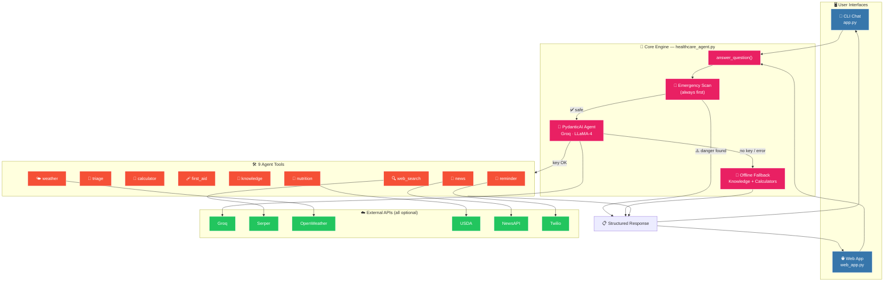
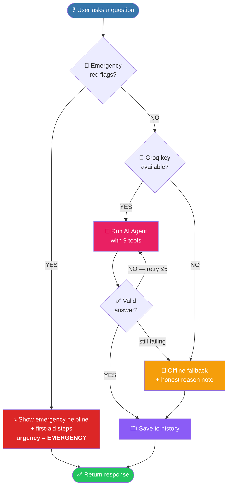
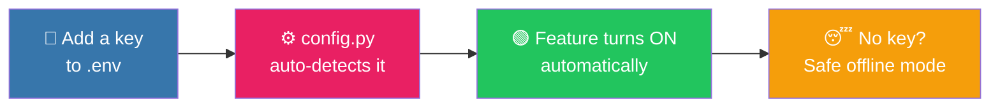
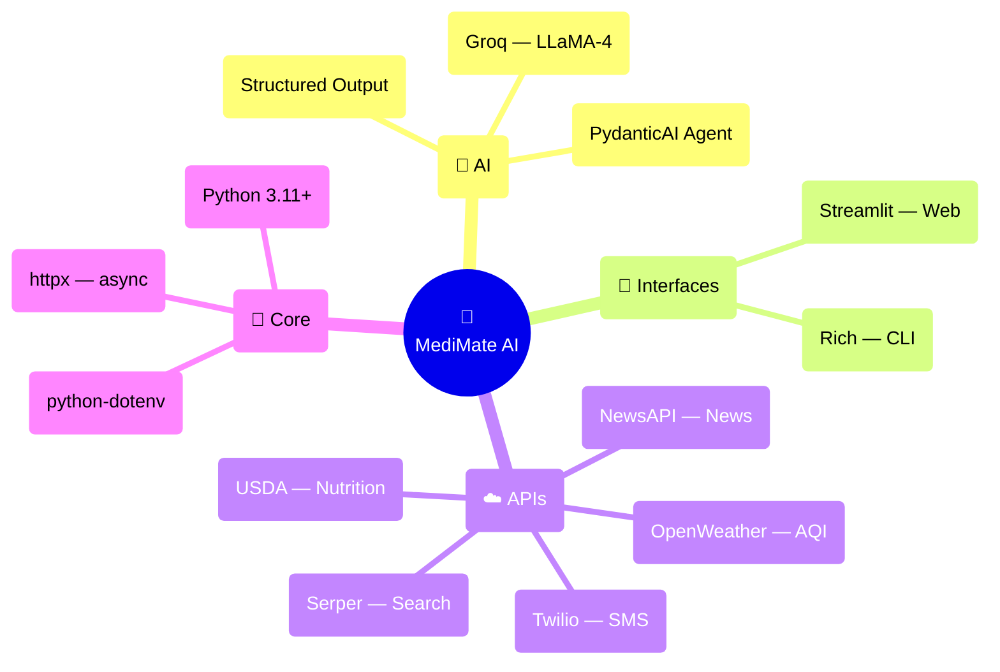

<div align="center">

# 🏥 MediMate AI

### *Your friendly, always-on health companion — safety-first, AI-powered, and offline-ready.*

<br/>

[](https://www.python.org/)
[](https://console.groq.com/)
[](https://ai.pydantic.dev/)
[](https://streamlit.io/)
[](#-license)

<br/>

**🚨 Detects emergencies · 🧠 Smart AI answers · 🧮 Health calculators · 🍎 Nutrition · 🌤️ AQI alerts · 💊 Reminders · 📴 Works offline**

</div>

---

## 📖 Overview

**MediMate AI** is **not just a chatbot** — it's a **safety-first health assistant** that scans *every*
message for medical emergencies *before* anything else, gives structured & validated AI answers, runs
health calculators, tracks nutrition, delivers first-aid steps, and searches the live web.

> 💡 **The best part?** It **still works with zero API keys and no internet** — thanks to a built-in
> knowledge base, calculators, Indian-food nutrition table, and offline first-aid guides. Add keys
> anytime and features light up automatically. **It is never useless.**

---

## ✨ Features

| # | Feature | What it does |
|:-:|---------|--------------|
| 🚨 | **Emergency Triage** | Scans every message for red flags (heart attack, stroke, breathing trouble, bleeding, suicidal thoughts…) and shows the right helpline **instantly**. |
| 🧠 | **AI Brain (Groq)** | Lightning-fast **LLaMA-4** answers with structured, schema-validated output. |
| 🛠️ | **9 Agent Tools** | web search · triage · calculators · first-aid · knowledge · nutrition · weather · news · reminders. |
| 🍎 | **Nutrition Tracker** | `2 roti + 1 cup dal + 1 egg` → calories + protein/carbs/fat (offline Indian-food table). |
| 🌤️ | **Weather + AQI Alerts** | Live air-quality health advice — *"AQI 180 — wear a mask, skip outdoor exercise."* |
| 💊 | **Medicine Reminders** | Set reminders; get a real **SMS (Twilio)** or an on-screen alert. |
| 📰 | **Health News Feed** | Latest curated health headlines. |
| 🧮 | **Health Calculators** | BMI · daily calories (TDEE) · water intake · ideal weight · heart-rate zones · body-fat %. |
| 🩹 | **Offline First-Aid** | Step-by-step guides for choking, burns, CPR, bleeding, snake bite & more. |
| 📖 | **Offline Knowledge Base** | Answers common conditions with **zero internet**. |
| 🗂️ | **Consultation History** | Saves every Q&A locally + exports a **Markdown health report**. |
| 🌐 | **Multi-Language** | Replies in English, Hindi, Hinglish, Spanish, French & Arabic. |
| 🎨 | **Beautiful UI** | Colorful CLI (`rich`) **and** a browser chat app (`streamlit`). |
| 📴 | **Graceful Fallback** | No key / no internet? It still helps. Add keys anytime — features auto-enable. |

---

## 🏗️ System Architecture



---

## 🔄 How a Question Flows (Safety-First Logic)



---

## 🚀 Quick Start

```bash
# 1️⃣  Clone the repo
git clone https://github.com/Abhay73888/HeathCare.git
cd HeathCare

# 2️⃣  Install dependencies
pip install -r requirements.txt

# 3️⃣  Add your API keys (optional but recommended)
cp .env.example .env       # then edit .env and paste your keys

# 4️⃣  Run it!
python app.py              # 💬 interactive CLI chat
streamlit run web_app.py   # 🌐 browser web app
python healthcare_agent.py # ⚡ quick demo
```

> ✅ **No keys? No problem.** MediMate boots straight into **offline mode** and still answers common
> conditions, runs calculators, and gives first-aid guides.

---

## 🔑 Getting API Keys *(all free tiers)*

| Service | Unlocks | Get a key |
|---------|---------|-----------|
| 🧠 **Groq** | AI brain (smart answers) | https://console.groq.com/keys |
| 🔍 **Serper** | Live web search | https://serper.dev |
| 🌤️ **OpenWeather** | Weather + AQI alerts | https://openweathermap.org/api |
| 🍎 **USDA** | Live nutrition lookup | https://fdc.nal.usda.gov/api-key-signup.html |
| 📰 **NewsAPI** | Health news feed | https://newsapi.org/register |
| 💊 **Twilio** | SMS reminders *(optional)* | https://www.twilio.com/try-twilio |

Paste them into `.env`. **Every key is optional** — add them one by one to unlock more features,
no code changes needed. Check what's live anytime with `/status`.



---

## 💬 Commands *(inside the app)*

| Command | Description |
|---------|-------------|
| `/help` | Show all commands |
| `/bmi` · `/calories` · `/water` | Health calculators |
| `/nutrition <meal>` | Calories & macros — e.g. `/nutrition 2 roti + 1 egg` |
| `/weather [city]` | Weather + air-quality health alert |
| `/news [topic]` | Latest health news |
| `/remind <med> <HH:MM>` | Set a medicine reminder — e.g. `/remind BP tablet 14:00` |
| `/reminders` | List your medicine reminders |
| `/firstaid <x>` | First-aid steps — e.g. `/firstaid choking` |
| `/topics` · `/history` · `/report` | Offline topics · past Q&A · export report |
| `/status` | See which features are **ON / OFF** |
| `/name <you>` · `/lang <language>` | Personalize |
| `/clear` · `/quit` | Clear history · exit |

---

## 📁 Project Structure

```
healthcare-ai/
├── 🖥️  app.py                # Interactive CLI chat (start here)
├── 🌐  web_app.py            # Streamlit browser chat app
├── 🧠  healthcare_agent.py   # The AI agent brain + 9 tools
├── ⚙️  config.py             # Settings, API keys, emergency numbers
├── 🧮  calculators.py        # Health math (no API needed)
├── 🚨  emergency.py          # Triage + first-aid engine
├── 📖  knowledge.py          # Offline medical knowledge base
├── 🍎  nutrition.py          # Meal calorie/macro tracker
├── 🌤️  weather_health.py     # Weather + air-quality alerts
├── 📰  news.py               # Health news feed
├── 💊  reminders.py          # Medicine reminders (+ SMS)
├── 🗂️  history.py            # Save consultations + export reports
├── 📦  requirements.txt      # Dependencies
├── 🔑  .env.example          # API key template
└── 📄  README.md             # You are here
```

---

## 🛠️ Tech Stack



---

## ⚠️ Medical Disclaimer

> **MediMate AI is for educational and informational purposes only.** It is **not** a substitute for
> professional medical advice, diagnosis, or treatment. Always consult a qualified healthcare provider.
> **In an emergency, call your local emergency number immediately.**

---

## 📜 License

Released under the **MIT License** — free to use, modify, and share.

---

<div align="center">

### 💚 Made with care for healthier lives

**If MediMate helped you, drop a ⭐ on the repo!**

<sub>Built by <a href="https://github.com/Abhay73888">Abhay Kumar Maurya</a> · Powered by Groq + PydanticAI</sub>

</div>
